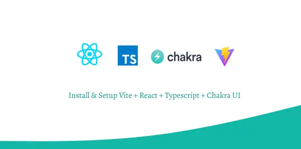

# Undangan Application

# Project Description

## Dokumentasi Run Code

### First You Can Clone This Repository With Comments

      git clone [repository name]

### After The Complete You Can Run

      npm install || pnpm install (for alternative)

### After This You Can Run With

      npm run dev || pnpm run dev
   or
      npm dev || pnpm dev

### After This You Can See For Page Like This

<a href="https://undangan-app.vercel.app/">https://undangan-app.vercel.app/</a>

## Dokumentasi Fungsi Components Section

### App.tsx

#### Import

      Kode ini mengimpor file App.css dan komponen MainPage dari direktori './sectionsPages/MainPage'.

#### Fungsi App

      Ini adalah komponen utama React yang akan di-render.
      Mengembalikan elemen 
 yang berisi komponen MainPage.
      Mengirimkan dua properti ke MainPage, yaitu backgroundImage dan text.

### MainPage.tsx

#### Import

         Mengimpor React dan beberapa komponen dari pustaka Chakra-UI, serta beberapa komponen kustom.
         Mengimpor useState untuk mengelola state komponen.
         Mengimpor useMediaQuery dari Chakra-UI untuk mengatur responsivitas.

#### Interface MainPageProps

         Mendefinisikan tipe data properti yang diterima oleh komponen MainPage.
         Properti backgroundImage dan text didefinisikan sebagai string.

#### Komponen MainPage

         Ini adalah komponen utama yang merupakan functional component.
         Menggunakan useMediaQuery untuk menentukan apakah lebar layar lebih besar dari 1200px.
         Menggunakan useState untuk mengelola beberapa state: showAlternateContent dan isLoading.
         Fungsi handleButtonClick
         Mengatur perilaku tombol. Mengubah isLoading menjadi true dan kemudian mengubah showAlternateContent kembali ke false setelah 1 detik (1000 ms).

#### Render

         Menggunakan JSX untuk menampilkan tampilan komponen.
         Bergantung pada nilai isLargerThan1200, tampilan yang sesuai akan ditampilkan.
         Terdapat dua bagian konten yang dapat ditampilkan berdasarkan nilai showAlternateContent.
         Menerapkan kondisional rendering berdasarkan nilai isLoading.

### ImageSlider.tsx

#### Import

         Mengimpor React, useState, dan useEffect.
         Mengimpor komponen Box dari Chakra-UI.

#### Data imageUrls

         Mengandung array URL gambar latar belakang yang akan digunakan dalam slider.

#### Komponen ImageSlider

         Ini adalah komponen yang digunakan untuk menampilkan slider gambar.
         Menggunakan useState untuk mengelola currentImageIndex yang menunjukkan indeks gambar saat ini.

#### Fungsi changeImage

         Mengubah gambar latar belakang menjadi gambar berikutnya dalam array imageUrls.

#### Menggunakan useEffect

         Mengatur interval untuk mengubah gambar setiap 2.5 detik.
         Membersihkan interval saat komponen dibongkar.

#### Render

         Menggunakan JSX untuk menampilkan slider gambar dengan gambar latar belakang yang berubah secara otomatis.

### MyCard.tsx

#### Variabel cardStyle dan imageStyle

      Mengandung gaya CSS untuk komponen "kartu" dan gambar di dalamnya.

#### Komponen MyCard

      Ini adalah komponen yang digunakan untuk menampilkan kartu dengan gambar dan teks.
      Menggunakan elemen 
 dan elemen-elemen HTML untuk menampilkan konten.

#### CSS Styling

   #### Font Import
         Mengimpor font dari Google Fonts menggunakan @import.

   #### Animasi
         Mendefinisikan dua animasi CSS, yaitu "pulse" dan "fadeOut"/"fadeIn". Animasi "pulse" digunakan pada tombol, sementara animasi "fadeOut" dan "fadeIn" digunakan untuk animasi transisi konten.
                  
         Semua kode di atas digunakan untuk membuat aplikasi React yang menampilkan tampilan berbasis komponen dengan responsivitas dan efek animasi yang menarik. Itu adalah komponen utama, slider gambar, dan kartu kustom yang membentuk halaman utama aplikasi. Animasi CSS juga digunakan untuk memberikan sentuhan visual tambahan.

### The Finish Of Decomentation :

### Create By : Muhammad Haidar Shahab

### So if you want know about me so you can see my profile:

[My Github](https://github.com/haidar180202) 

[My Gitlab](https://gitlab.com/haidar1802/myapp)

[My Portfolio](https://profile-muhammad-haidar-shahab.netlify.app/)

